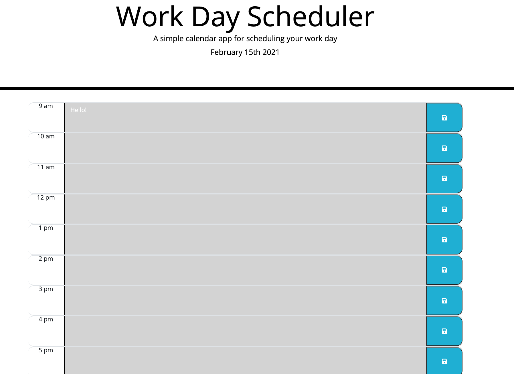

# 05 Work Day Planner README
## This is a readme file for my work day planner.

I built this project using the prebuilt html and css files. I altered the html to create the timeblocks and being able to connect them to JS. I used jQuery, moment.js, and Bootstrap to create this app.

## How It Works
1. The calendar shows the workday: 9 - 5.
2. The workday is broken up into one hour time-blocks.
3. The past is shown in grey, the present in red, and the future in green.
4. The user is able to input events into the timeblock using the textarea and save button.

[Demo of My Page](https://drive.google.com/file/d/1VVtBV98lrKYAz3Ss0TwehAuZqn_1vYid/view)

[Link to Application](https://rachelamos.github.io/workDayPlanner/)

## Contributors

- Rachel Amos

## License & copyright

© Rachel Amos
Licensed under the [MIT License](LICENSE).

